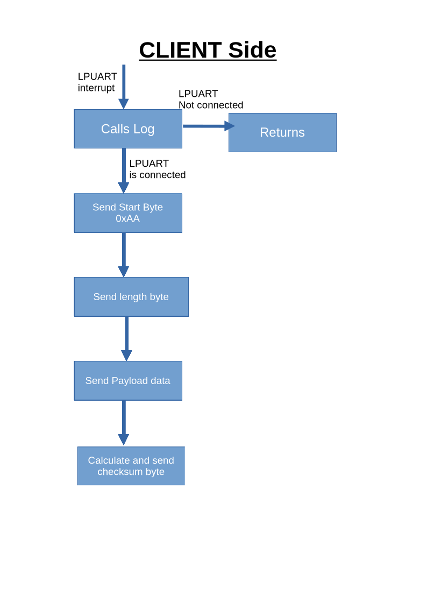
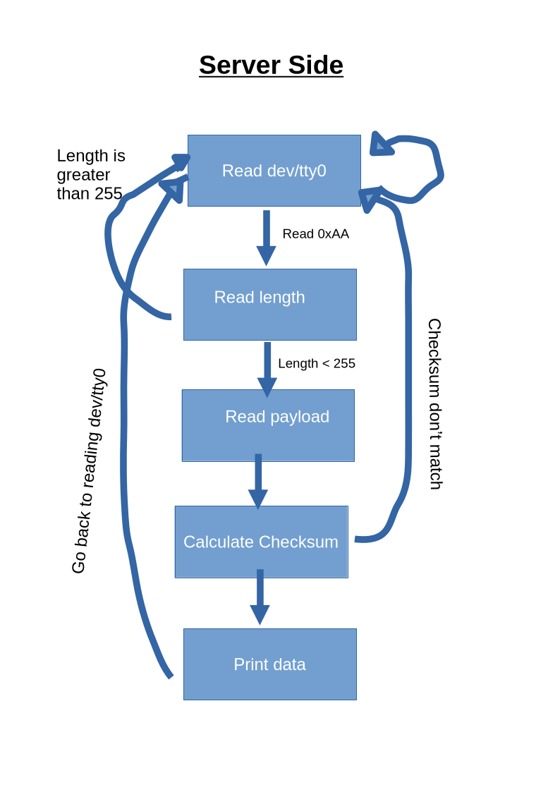

 # LPUART Driver 
 
 <b>*Description*</b>
 
 This Driver will be split between the server and client. The server will be the PC with the terminal, and the client is the MCU.
 
 <b>*Implementation*</b>

 The driver will initialize the LPUART on the board to allow for the nucleo-g474re to send bytes to dev/tty0 for debugging purposes.
 I will use the 8 bit character frame using the default lse clock for 9600 baud using the '00' moder. 

 I will use a ringbuffer that will hold 8 bytes of information, so once the ringbuffer is full it will print its contents

 The mcu will only transmit or read data only if the LPUART_CTS is enabled. 

To send information, it will send the "word" byte per byte through this cycle:

    """Description | what the lpuart tx sends"""
    -define the start byte as 0xAA | 0_1010_1010_1
    -send a length byte | 0_xxxx_xxxx_1 where x will be treated as a uint8 to define the number of bytes that will be read
    -sends the data | 0_xxxx_xxxx_1 where x represents the byte of the data
    -sends the checksum byte defined as length ^ byte for byte in data

To read information, it will follow this cycle:

    """Description | what the lpuart rx reads"""
    -begin the read when 0xAA is detected
    -record the length
    -fills the ring buffer with the bytes from the payload
    -once either the buffer is full or the length is exhausted, prints buffer

